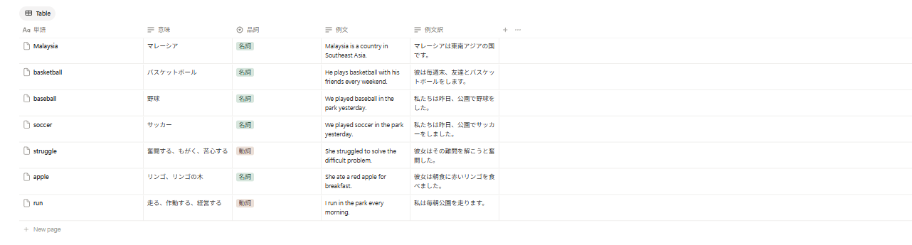

# word-saver

英単語を入力すると、Gemini API で意味・品詞・例文を調べ、Notion API で自分の単語帳データベースに自動保存する CLI ツールです。

```
単語> ran
  run（入力: ran） [動詞]
  意味  : 走る、作動する、経営する
  例文  : I run in the park every morning.
  例文訳: 私は毎朝公園を走ります。
  ✓ Notionに保存しました https://app.notion.com/p/run-...

単語> socccer
  ？ 「socccer」はつづりミスかもしれません。もしかして「soccer」ですか？ [Y/n] y
  soccer（入力: socccer） [名詞]
  意味  : サッカー
  ...
```

保存された Notion の単語帳：



## 工夫した点

- **構造化出力**: Gemini に `response_schema`（Pydantic モデル）で JSON の形を指定し、出力の揺れで保存処理が壊れないようにしています。品詞は選択肢を固定し、Notion のセレクトと対応させています。
- **原形への変換と重複チェック**: `ran` と入力しても `run` として保存し、Notion を検索して登録済みなら保存をスキップします。
- **混雑時の自動再試行とモデル切り替え**: Gemini の混雑（503）時は再試行し、それでも駄目な場合や無料枠の上限（429）に達した場合は予備モデル（`GEMINI_FALLBACK_MODELS`）に自動で切り替えます。成功したモデルを次回最初に試すので、混雑が続いても待たされません。
- **つづりミスの補正**: `socccer` のようなつづりミスは、Gemini が同じリクエスト内で正しい単語（soccer）を推測して情報を返します。「もしかして soccer ですか？」と確認してから保存するので、API の呼び出し回数も増えません。英単語でない入力は保存しません。
- **APIキーの管理**: キーは `.env` に分離し、`.gitignore` で GitHub に上がらないようにしています。
- **エラー時のヒント**: Notion の 401 / 404 / 400 エラーに、よくある原因を添えて表示します。

## セットアップ

### 1. Notion

1. 新しいデータベース（表）を作り、プロパティを次の名前・種類で作成します（名前はコードと完全一致）。

   | プロパティ名 | 種類 |
   |---|---|
   | 単語 | タイトル |
   | 意味 | テキスト |
   | 品詞 | セレクト |
   | 例文 | テキスト |
   | 例文訳 | テキスト |

2. [notion.so/my-integrations](https://www.notion.so/my-integrations) でインテグレーションを作成し、シークレットをコピーします。
3. データベースページ右上の「…」→「接続」から、作ったインテグレーションを追加します（忘れると 404 エラー）。
4. データベースの URL `notion.so/xxxx/<32文字のID>?v=...` の 32 文字部分がデータベース ID です。

### 2. Gemini

[Google AI Studio](https://aistudio.google.com) で API キーを発行します。

### 3. 実行

```bash
cd word-saver
python -m venv .venv
.venv\Scripts\activate          # macOS / Linux は source .venv/bin/activate
pip install -r requirements.txt
copy .env.example .env          # macOS / Linux は cp
# .env に GEMINI_API_KEY / NOTION_TOKEN / NOTION_DATABASE_ID を記入
python main.py
```

引数で複数の単語をまとめて登録することもできます。

```bash
python main.py run apple mice
```

## 使用技術

Python / Gemini API（google-genai） / Notion API / Pydantic
